

  

# 다행 (Dahaeng)

> 다음 여행을 행복하게
>
> YouTube 시청 이력과 여행 성향을 분석해 161개 도시 중 나에게 맞는 여행지를 AI가 추천하는, 빅데이터 분산 처리 기반 3D 지구본 여행 플랫폼

- 프로젝트 기간: 2026.02 ~ 2026.04 (6주) — SSAFY 14기 빅데이터 분산 트랙 특화 프로젝트
- 개발 인원: 6명 (FE 2, BE 4)
- 배포: [youtube-data-based-travel-recommendation.pages.dev](https://youtube-data-based-travel-recommendation.pages.dev)

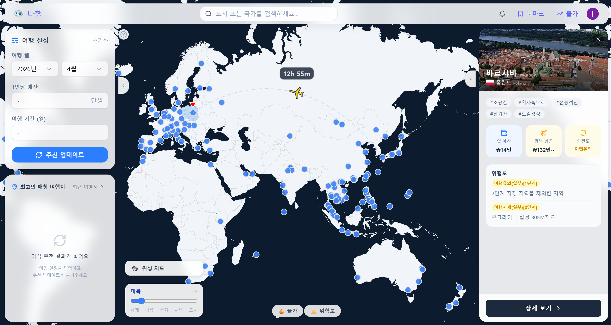

## 목차

- [기획 배경](#기획-배경)
- [서비스 주요 기능](#서비스-주요-기능)
- [주요 화면 및 기능 소개](#주요-화면-및-기능-소개)
- [프로젝트 핵심 기술](#프로젝트-핵심-기술)
- [시스템 아키텍처](#시스템-아키텍처)
- [ERD](#erd)
- [팀원 소개](#팀원-소개)
- [기술 스택](#기술-스택)

## 기획 배경

### **"어디로 가야 할지부터 막막한" 여행 준비를, 보고만 있던 데이터로 가볍게**

여행을 계획할 때 가장 먼저 막히는 지점은 "그래서 어디로 가지?" 입니다. 여행지는 수백 곳이고, 예산·안전·취향까지 따지면 선택지는 기하급수적으로 늘어나는데, 정작 이를 좁혀주는 서비스는 인기 순위나 광고성 추천이 대부분이라 "내 취향"이 반영되지 않습니다.

기존 여행 추천 서비스는 사용자가 설문이나 태그를 직접 입력해야 개인화가 시작됩니다. 하지만 이 입력 과정 자체가 진입장벽이고, 막상 입력해도 "한식, 자연, 액티비티" 같은 뭉뚱그려진 답변으로는 세밀한 추천이 어렵습니다.

반면 유튜브 시청 이력은 사용자가 의식하지 않고 쌓아온, 가장 정직한 취향 데이터입니다. 어떤 여행 유튜버를 구독하고, 어떤 영상에 좋아요를 눌렀는지는 설문보다 훨씬 구체적으로 "이 사람이 무엇을 좋아하는지"를 보여줍니다.

다행은 이 시청 이력을 분석해 여행 태그를 자동으로 추출하고, 여기에 예산·여행 기간·안전도 같은 현실적인 제약을 더해 161개 도시 중 실제로 갈 만한 곳을 추천합니다. 항공권 가격, 물가 비교, 현지 위험도, 관광지 정보까지 한 화면에서 확인할 수 있도록 묶어, 추천을 받은 뒤 곧바로 여행을 구체화할 수 있게 만드는 것이 목표입니다.

## 서비스 주요 기능

### AI 맞춤 여행지 추천

- Google OAuth로 YouTube 시청 이력(좋아요 영상, 재생목록, 구독 채널)을 수집해 AI가 여행 관심 태그를 자동 추출
- 예산·여행 기간·위험 감수도와 추출된 태그를 함께 반영해 161개 도시 중 점수 기반 추천
- 3D 지구본에서 추천 도시 마커가 점수에 비례해 크기·색상으로 변화

### 도시 상세 정보

- 추천 이유, 항공권 가격 캘린더, 현지 물가 비교(서울 대비), 위험도, 관광지/근처 명소를 탭으로 분리해 한 화면에서 확인
- Gemini 2.5 Flash로 관광지 좌표 기반 동선 최적화 여행 코스 자동 생성

### 물가 비교

- 도시·국가 단위로 서울과의 생활물가(식비, 교통, 식료품, 외식 등)를 항목별로 비교
- 실시간 환율을 반영한 통화 환산

### 항공권 가격 알림

- 도시별 항공권 희망 가격을 등록하면, 수집된 가격이 기준 이하로 떨어질 때 이메일로 알림

### 북마크

- 추천받은 도시를 저장해 추천 당시의 점수·항공권·물가·뉴스 스냅샷을 그대로 보관

## 주요 화면 및 기능 소개

### 1. 로그인 & 온보딩

| 로그인 | YouTube 연동 동의 |
|---|---|
| 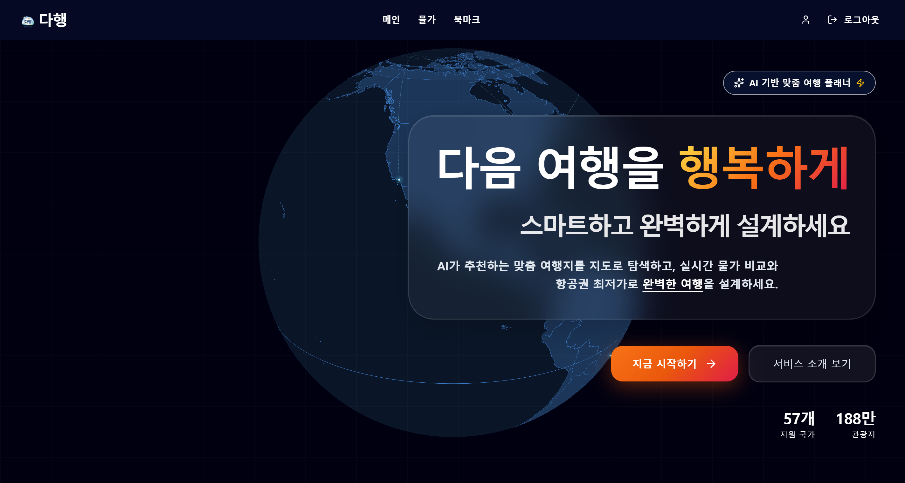 |  |

- Google OAuth 2.0으로 로그인합니다.
- 로그인 직후 YouTube 시청 이력 분석에 동의하면, 이 데이터를 기반으로 초기 관심 태그를 자동 설정합니다.

---

### 2. YouTube 취향 분석

| 분석 중 | 분석 결과 |
|---|---|
|  | 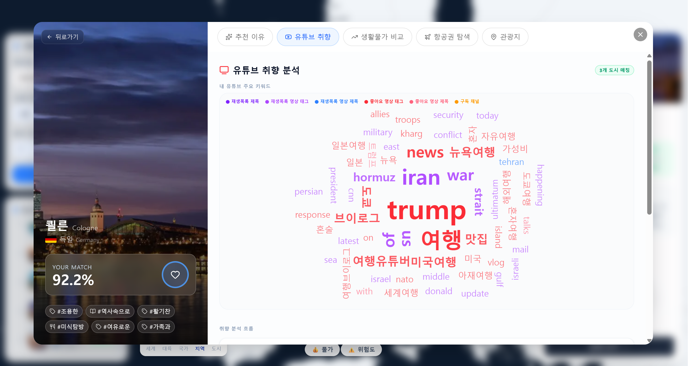 |

1~2분 소요되는 분석 과정을 단계별로 시각화하고, 완료되면 키워드 워드클라우드와 함께 "유튜브 키워드 → AI 분석 이유 → 관심 태그 → 도시 태그 → 도시" 흐름을 다이어그램으로 보여줍니다.

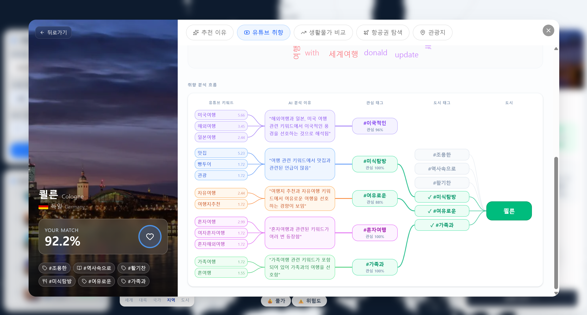

---

### 3. 메인 — 3D 지구본 추천

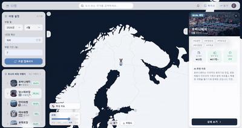

추천 결과를 받으면 지구본의 도시 마커가 추천 점수에 따라 크기·색상이 즉시 바뀌고, 추천되지 않은 도시는 회색으로 전환됩니다.

---

### 4. 비행 로딩 애니메이션

도시 클릭 후 AI 추천 계산 중에는 단순 스피너 대신, 서울에서 목적지까지 비행기가 날아가는 애니메이션과 진행률을 함께 보여줍니다.

---

### 5. 추천 이유 탭

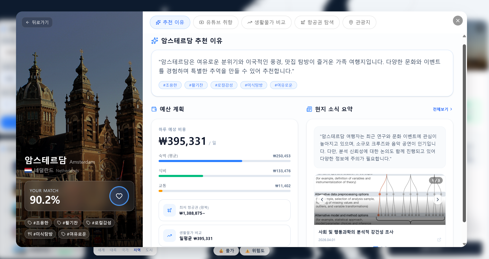

해당 도시가 왜 추천되었는지를 자연어 설명과 함께, 예산 분포·항공권·현지 뉴스 요약으로 보여줍니다.

---

### 6. 항공권 가격 & 알림

| 가격 캘린더 | 가격 추이 |
|---|---|
| 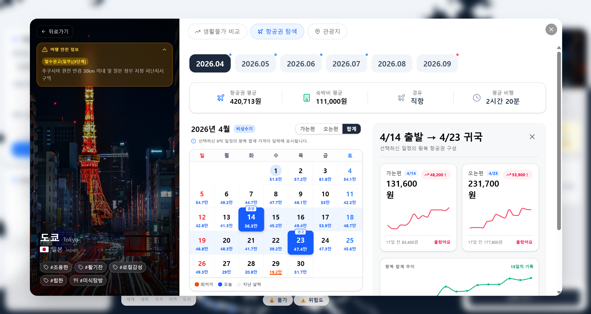 | 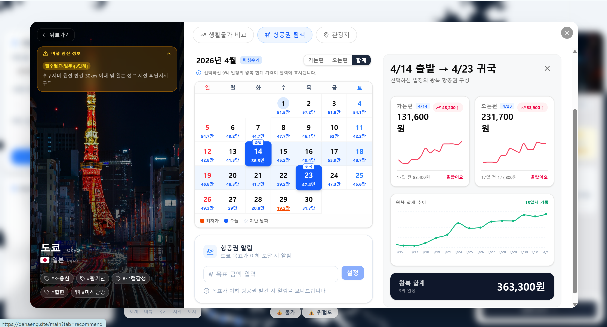 |

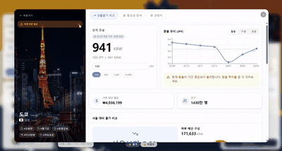

날짜별 항공권 가격을 캘린더 히트맵으로 보여주고, 날짜에 마우스를 올리면 최근 수집 이력이 함께 표시됩니다.

| 가격 알림 등록 | 알림 이메일 |
|---|---|
|  | 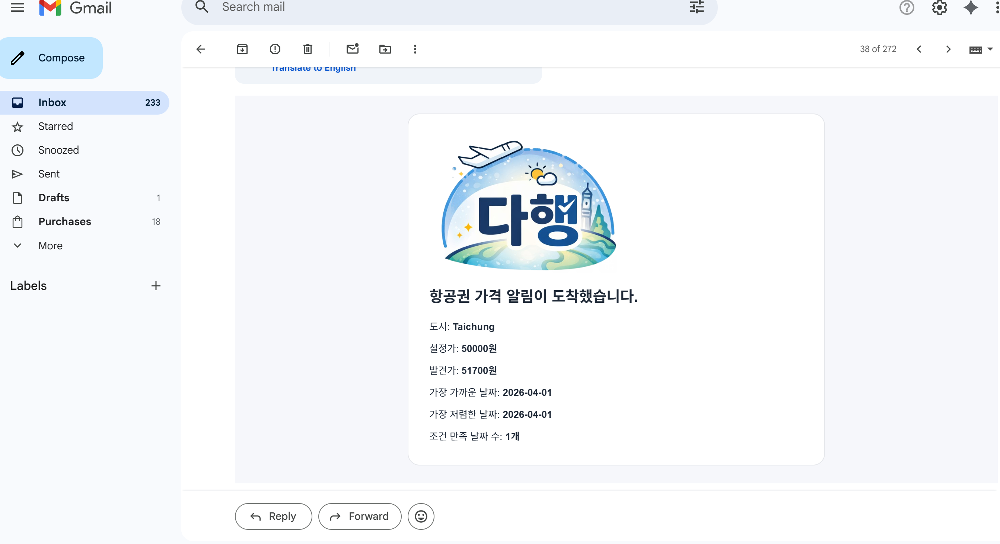 |

희망 가격을 등록해두면 기준 이하로 떨어졌을 때 이메일로 알려줍니다.

---

### 7. 물가 비교

| 서울과 비교 | 세부 항목 비교 | 환율 |
|---|---|---|
| 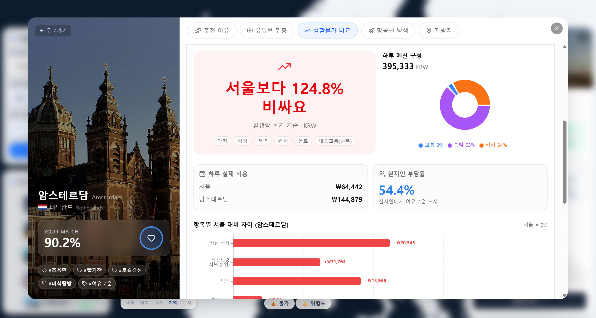 | 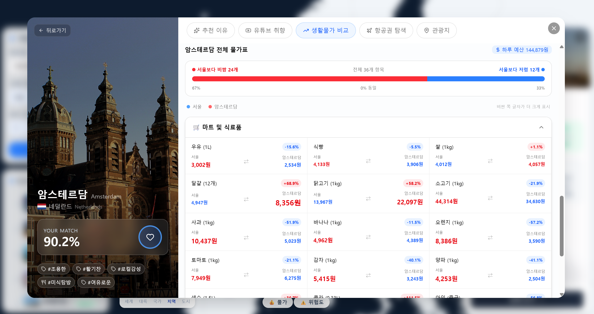 | 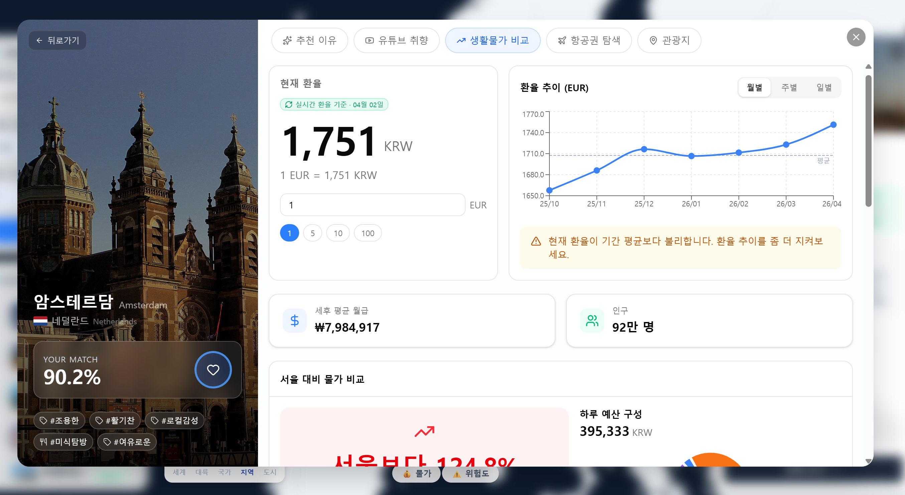 |

---

### 8. 관광지 추천

| AI 추천 관광지 | 근처 관광지 |
|---|---|
| 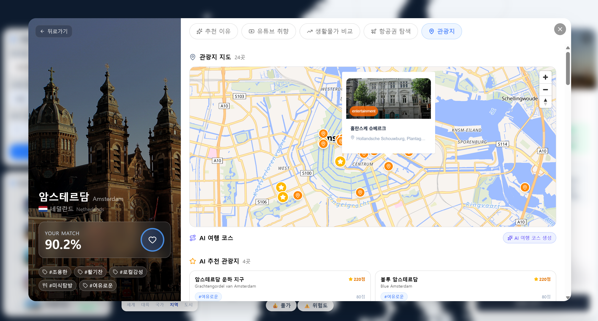 | 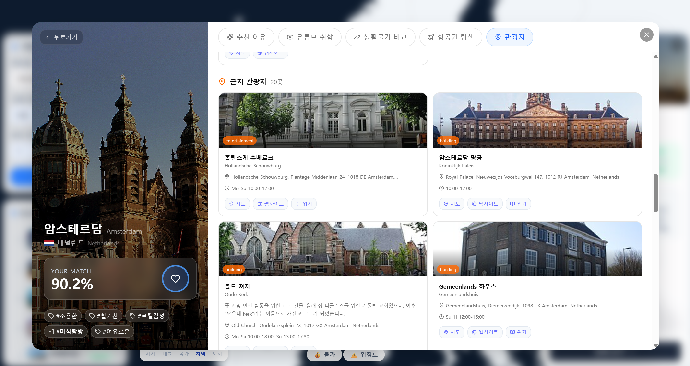 |

## 프로젝트 핵심 기술

### **빅데이터 분산 파이프라인**

- 항공권(Trip.com 스크래핑), 환율, 생활물가, 여행 위험도, 관광지(Geoapify) 데이터를 도메인별 Python 워커로 분리 수집
- HDFS에 원본(Bronze)·정제(Silver) 계층으로 적재한 뒤 MySQL/MongoDB로 서빙 — 수집과 서빙 책임을 분리해 한쪽 장애가 다른 쪽에 영향을 주지 않도록 구성
- Redis를 캐시 계층으로 두어 반복 조회되는 관광지 데이터(Geoapify) 응답 속도 개선

### **YouTube 기반 AI 취향 분석**

- Google OAuth로 수집한 좋아요 영상·재생목록·구독 채널 데이터에서 키워드를 추출하고 출처(재생목록 제목/영상 태그/구독 채널 등)별로 가중치를 둬 관심 태그를 산출
- Spring AI(OpenAI) 기반으로 추출된 키워드를 여행 태그·카테고리로 매핑

### **AI 여행 코스 생성 (Gemini 2.5 Flash)**

- 관광지 좌표와 사용자 관심 태그 상위 5개를 프롬프트에 반영해 동선이 효율적인 테마별 여행 코스를 생성
- `responseJsonSchema`로 응답 구조를 강제하고 프론트에서 Zod로 다시 검증하는 이중 방어로 파싱 실패를 차단

### **3D 인터랙티브 지구본**

- `react-globe.gl`(Three.js/WebGL) 기반으로 161개 도시 마커를 렌더링하고, 추천 점수에 따라 마커 크기·색상을 동적으로 변경
- 도시 hover/mousedown 시점에 상세 데이터를 prefetch해 클릭 시 로딩 없이 즉시 패널을 오픈

### **타입 안전 API 레이어**

- 프론트엔드 14개 API 엔드포인트에 Zod 스키마를 적용해 백엔드 응답을 런타임에서 검증 — 스펙이 바뀌면 `parse()` 단계에서 즉시 에러로 드러남
- `queryKeys` 팩토리 패턴(`as const` 튜플)으로 TanStack Query 캐시 키를 컴파일 타임에 검증

## 시스템 아키텍처

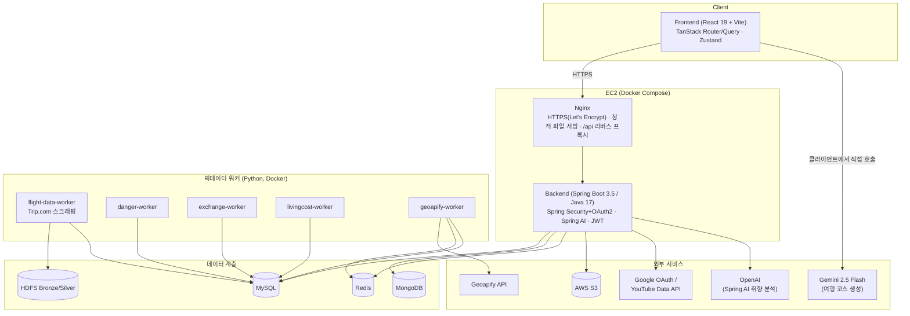

## ERD

> 실제 스키마(35개 테이블) 중 핵심 도메인 관계만 정리했습니다. YouTube 원시 수집 테이블(`youtube_playlist`, `youtube_video` 등)은 `youtube_account`로 묶어 표현했습니다.

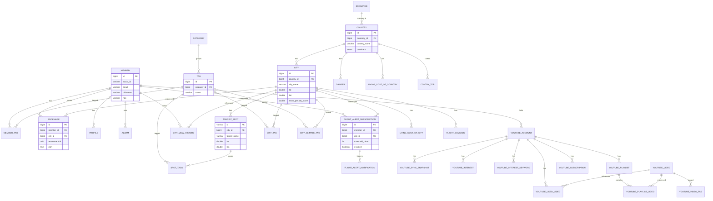

## 팀원 소개

<table>
  <tr>
    <td align="center">
      
    </td>
    <td align="center">
      
    </td>
    <td align="center">
      
    </td>
  </tr>
  <tr>
    <td align="center">
       
      <a href="https://github.com/minseozzing">김민서</a> 
      아키텍처 설계 · 도시 상세 패널 UI · 물가 비교 페이지 · 비행 로딩 애니메이션 · 항공권 크롤링
    </td>
    <td align="center">
       
      <a href="https://github.com/choiinho97">최인호</a> 
      YouTube 취향 분석 UI · YouTube 연동 동의 플로우 · 여행 설정 탭 · 매칭 여행지 탭
    </td>
    <td align="center">
       
      <a href="https://github.com/KibeomGwon">권기범</a> 
      물가 · 북마크 · 환율 · 태그 · 최근 본 도시 API · Geoapify 인프라 설정
    </td>
  </tr>
  <tr>
    <td align="center">
      
    </td>
    <td align="center">
      
    </td>
    <td align="center">
      
    </td>
  </tr>
  <tr>
    <td align="center">
       
      <a href="https://github.com/Min-code0202">정재민</a> 
      YouTube 동기화 및 관심사 분석 파이프라인 · AI 태그 추출
    </td>
    <td align="center">
       
      <a href="https://github.com/s00cong">황수빈</a> 
      항공권 크롤링(Trip.com) · Spark ETL · HDFS 데이터 파이프라인
    </td>
    <td align="center">
       
      <a href="https://github.com/Bae-JunSeok">배준석</a> 
      추천 점수 산정 로직 · 도시(City) API · 위험도 처리
    </td>
  </tr>
</table>

## 기술 스택

### Frontend

  
  
  
  
  
  
  
  
  
  
  
  

### Backend

  
  
  
  
  
  
  
  
  
  

### Data / AI

  
  
  
  
  
  
  

### Infra

  
  
  
  
  

