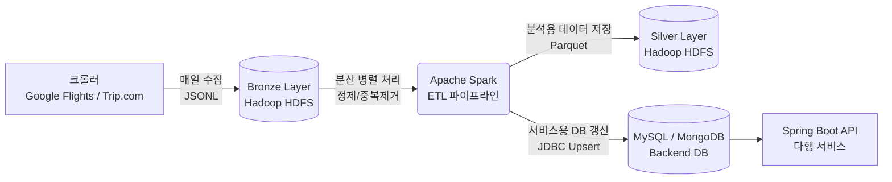

# 🚀 다행(Dahaeng) 항공/숙박 빅데이터 파이프라인 아키텍처 (To-Be)

본 문서는 향후 다행 서비스의 핵심 기능인 "항공권/숙박 가격 추이 및 캘린더" 제공을 위해 도입될 **빅데이터 파이프라인(Hadoop + Spark)**의 구축 배경과 아키텍처를 설명하기 위한 발표 자료입니다.

---

## 1. 💡 почему 하둡(Hadoop)과 스파크(Spark)인가? (도입 배경)

다행 서비스는 전 세계 100여 개 주요 도시의 **날짜별 항공권 최저가, 비행 시간, 경유 정보, 그리고 평균 숙박비 데이터**를 크롤링하여 사용자에게 제공합니다.

### 기존 RDBMS(MySQL) 단일 구조의 한계
* **데이터 폭증**: 매일 100개 도시 × 365일치(약 3만~4만 건)의 가격 데이터가 누적됩니다. 1년만 운영해도 수천만 건 이상의 시계열 데이터가 쌓입니다.
* **조회 속도 저하**: "작년 이맘때 대비 가격 변동률", "최근 30일 가격 추이" 등 대규모 시계열 통계 및 집계를 실시간으로 MySQL에서 처리하기에는 부하가 큽니다.
* **원본 데이터 보존의 필요성**: 크롤링 중단이나 로직 변경에 대비하여, 가공되기 전의 "원본 데이터(Raw Data)"를 안전하고 저렴하게 무기한 보관할 공간이 필요합니다.

### 해결책: Data Lake 아키텍처 도입
이러한 문제를 해결하기 위해, 확장성이 무한하고 대단위 분산 처리에 특화된 **Hadoop(분산 스토리지) + Spark(분산 처리 엔진)** 기반의 데이터 레이크를 구축합니다.

---

## 2. 🗺️ 데이터 파이프라인 아키텍처 (To-Be)

전체 파이프라인은 메달리온 아키텍처(Medallion Architecture; Bronze → Silver → MySQL)를 따릅니다.

### 단계별 상세 역할

#### 🥉 1. Bronze Layer (데이터 원천 저장소)
* **저장 위치**: Hadoop HDFS (`/data/bronze/airticket/`)
* **포맷**: `JSONL` (유연한 스키마 대응)
* **역할**: 크롤러가 수집한 **원본 데이터(Raw Data)를 영구 보존**합니다. 언제든지 ETL 로직이 변경되더라도 여기서부터 데이터를 다시 100% 복구(Replay)할 수 있습니다.

#### 🥈 2. Spark ETL (데이터 정제 엔진)
* **역할**: 매일 수집된 수만 건의 Bronze 데이터를 읽어와, 에러 데이터를 걸러내고(Data Quality), 최신 가격 정보로 갱신하며, 서비스에 필요한 수치형 데이터로 변환합니다. Spark의 인메모리 분산 처리로 빠르게 수행합니다.

#### 🥈 3. Silver Layer (분석/집계용 스토리지)
* **저장 위치**: Hadoop HDFS (`/data/silver/flight_summary/`)
* **포맷**: **`Parquet` (컬럼 기반 압축 포맷)**
* **역할**: Spark가 정제한 데이터를 저장합니다. Parquet 포맷을 사용하여 데이터 용량을 극적으로 줄이고(CSV 대비 1/5 수준), 특정 컬럼만 빠르게 조회하는 빅데이터 분석(EDA/ML)에 완벽하게 대응합니다.

#### 🥇 4. Service DB (최종 서빙)
* **저장 위치**: MySQL (`dahaeng`), MongoDB (`flight_price_calendar`)
* **역할**: Spark 파이프라인의 최종 종착지로, 사용자의 API 요청에 실시간(ms 단위)으로 응답하기 위해 최신 요약 데이터와 캘린더 데이터만을 보관합니다. 서비스 DB의 부하를 최소화합니다.

---

## 3. ✨ 기대 효과 (Expected Benefits)

1. **안정적인 대용량 데이터 적재**
   * 관계형 DB 용량 초과에 대한 걱정 없이, 날짜별 크롤링 데이터를 영구적으로 HDFS에 적재합니다.
2. **과거 데이터 기반의 AI / 통계 확장성**
   * 차후 "AI 기반 특정 월 최저가 예측"이나 "여행지 추천 알고리즘"을 개발할 때, Silver Layer의 Parquet 데이터를 바로 Spark MLlib로 연결하여 모델을 학습시킬 수 있습니다.
3. **무중단 복구(Resilience)**
   * 만약 서비스 DB(MySQL)의 항공권 테이블 데이터가 날아가더라도, Hadoop의 Bronze 레이어부터 단 한 번의 Spark Job 실행으로 전체 데이터를 완벽히 복원할 수 있습니다.
4. **ETL 파이프라인의 모듈화**
   * 수집(크롤러) - 정제(Spark) - 서비스(Spring+DB)가 완전히 분리되어 있어, 어느 한 쪽에 장애가 발생해도 연쇄적인 서버 다운을 방지할 수 있습니다.

---

## 4. 📅 향후 구축 로드맵

* **Phase 1 (현재)**: 로컬 파일 시스템 기반 파이프라인 검증 및 Spark ETL 로직(bronze_to_silver) 구현 완료.
* **Phase 2 (적용)**: EC2 인스턴스에 Hadoop / Spark 클러스터 프로비저닝, HDFS 환경으로 데이터 마이그레이션.
* **Phase 3 (자동화)**: Airflow를 도입하여 크롤러 실행 → Spark ETL → DB 적재로 이어지는 배치를 매일 새벽 자동화 수행.

---

## 5. 🧹 데이터 정제(Data Refinement) 전략

매일 쏟아지는 수만 건의 원본 데이터를 서비스에 바로 쓸 수는 없습니다. 저희 팀은 **Apache Spark**를 활용하여 다음과 같은 3단계 정제 과정을 거쳐 고품질의 데이터를 만들어냅니다.

### 1️⃣ 필터링 및 데이터 타입 캐스팅 (Data Parsing)
* **문제점**: 크롤러가 수집한 JSON 포맷은 스키마가 엄격하지 않아, "₩350,000" 같은 문자열 형태로 가격이 혼재되어 들어옵니다.
* **정제 방식**: DataFrame API를 활용해 필요한 목적지 데이터(`explore_monthly_snapshot`)만 1차로 걸러냅니다. 이후 문자열로 된 가격, 비행 시간 등의 데이터를 **정수형(Integer)으로 안전하게 변환(Casting)**하여 통계 분석이 가능한 상태로 만듭니다.

### 2️⃣ 중복 제거 및 최신화 (Deduplication)
* **문제점**: 크롤러가 재실행되거나 동일한 도시/날짜 조합의 데이터가 중복 수집될 경우, 통계가 왜곡될 수 있습니다.
* **정제 방식**: Spark의 윈도우 함수(`Window.partitionBy`)를 사용하여 **동일한 도시 + 연월(Year-Month) 기준**으로 파티션을 나눕니다. 그중 가장 최신 수집 시각(`collected_at`)을 가진 데이터 **단 1건만 남기고 중복을 제거**하여 데이터의 일관성을 100% 보장합니다.

### 3️⃣ 관계형 데이터 결합 및 최적화 (Join & Upsert)
* **문제점**: HDFS에 저장된 정제 데이터(도시명: "파리")와 백엔드 DB 간의 식별자(PK) 타입이 다릅니다.
* **정제 방식**: HDFS에서 정제된 데이터를 서비스에 적재하기 전, Spark JDBC를 통해 MySQL의 `city` 마스터 테이블과 **분산 조인(Join)**을 수행합니다. "파리"라는 문자열을 백엔드의 고유 외래키(ID)로 변환한 뒤, **REPLACE INTO(Upsert) 방식**으로 스테이징 테이블을 거쳐 무중단으로 서비스 DB를 갱신합니다.

---

### 🎤 기대 효과 (발표 요약)
> "저희 파이프라인의 핵심은 **Spark를 활용한 무결성 확보와 부하 분산**입니다. 크롤러의 데이터 파편화나 중복 이슈를 완벽히 통제하면서도, 백엔드의 PK 테이블과 조인하는 무거운 작업들을 모두 **DB 밖에서 미리 분산 처리**합니다. 덕분에 앱 구동 중인 MySQL 데이터베이스는 연산 부하 없이, 언제나 깔끔하게 정제된 최신 결과물만 전달받게 됩니다."
